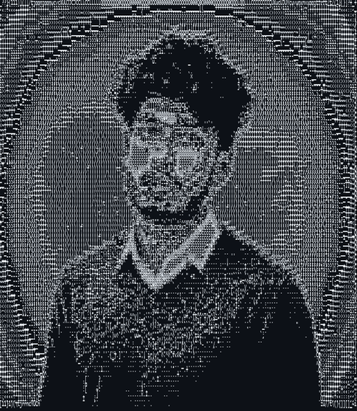
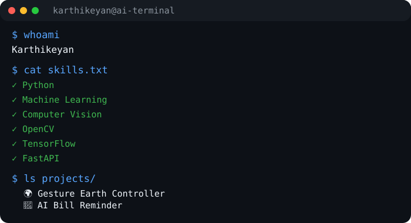

<div align="center">


<br><br>

<a href="https://linkedin.com/in/YOUR_LINKEDIN">

</a>

<a href="https://github.com/AGR2101">

</a>

<a href="https://leetcode.com/YOUR_LEETCODE">

</a>

<a href="mailto:YOUR_EMAIL@gmail.com">

</a>

<br><br>


</div>

---

# 💻 Terminal

<table align="center" width="100%">
<tr>

<td width="35%" align="center">



</td>

<td width="65%">



</td>

</tr>
</table>

---

# 👨‍💻 About Me

```yaml
Name      : Karthikeyan
Role      : AI & Data Science Student
Location  : India

Programming:
  - Python
  - Java
  - SQL

Specialization:
  - Artificial Intelligence
  - Machine Learning
  - Computer Vision

Currently Learning:
  - Deep Learning
  - Agentic AI
  - LangChain
  - LangGraph

Goal:
  Build Real-World AI Products
```

---

# 🚀 Tech Stack

## 💻 Languages

<p align="center">


</p>

---

## 🤖 AI & Machine Learning

<p align="center">


</p>

<p align="center">


</p>

---

## 🛠 Tools

<p align="center">


</p>

---

# 🚀 Featured Projects

| 🌍 Project | Description |
|------------|-------------|
| Gesture Earth Controller | Control Google Earth using Hand Gestures |
| AI Bill Reminder | AI-powered Expense Reminder |
| COVID Detection | Medical Image Classification |
| Smart Bottle Return Machine | YOLOv8 + Raspberry Pi |
| OpenCV Projects | Face Detection • Hand Tracking • Object Detection |

---

# 📊 GitHub Statistics

<p align="center">


</p>

---

# 🔥 GitHub Streak

<p align="center">


</p>

---

# 📈 Contribution Graph

<p align="center">


</p>

---

# ⚡ Fun Fact

```python
class Karthikeyan:

    def __init__(self):
        self.languages = ["Python", "Java"]
        self.ai = [
            "OpenCV",
            "TensorFlow",
            "YOLO",
            "LangChain"
        ]
        self.goal = "Build AI Products"

    def greet(self):
        return "Thanks for visiting my GitHub! 🚀"
```

---

<div align="center">

### ⭐ Thanks for visiting my profile!

If you like my projects, consider giving them a ⭐

</div>


